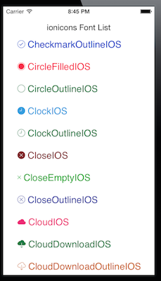

Common icons font for UILabel, UIButton, UITextField. Life should be easy.





## Getting Started
#### Step A:
Copy ionicons.ttf, IonIconsKit.h, IonIconsKit.m into your project.
#### Step B:
Info.plist Settings. Add "Fonts provided by application" item by clicking on the "+" icon, then set "Item 0" with value "ionicons.ttf".


## Sample Code

#### Use ionicons with UILabel:

```objective-c
#import "IonIconsKit.h"

...

UILabel *label = [[UILabel alloc] init];
label.text = [NSString stringWithIonIcon:IonIconClock]; // Get icon string
label.font = [UIFont ioniconsFontOfSize:38.f];          // Set ionicons font with size
```
Also you can use it with UIButton, ...

#### Use ionicons as loading spinner (add animations to UILabel)

```objective-c
label.frame = CGRectMake(50, 5, 36, 36);  // Square frame
[label runSpinnerViewWithDuration:20.f];  // in seconds
```

## Reference
* [ionicons](https://github.com/driftyco/ionicons)
* [icons preview](http://ionicons.com/)

## License
Copyright (c) 2014 sanfriend.com

Permission is hereby granted, free of charge, to any person obtaining a copy
of this software and associated documentation files (the "Software"), to deal
in the Software without restriction, including without limitation the rights
to use, copy, modify, merge, publish, distribute, sublicense, and/or sell
copies of the Software, and to permit persons to whom the Software is
furnished to do so, subject to the following conditions:

The above copyright notice and this permission notice shall be included in
all copies or substantial portions of the Software.

THE SOFTWARE IS PROVIDED "AS IS", WITHOUT WARRANTY OF ANY KIND, EXPRESS OR
IMPLIED, INCLUDING BUT NOT LIMITED TO THE WARRANTIES OF MERCHANTABILITY,
FITNESS FOR A PARTICULAR PURPOSE AND NONINFRINGEMENT. IN NO EVENT SHALL THE
AUTHORS OR COPYRIGHT HOLDERS BE LIABLE FOR ANY CLAIM, DAMAGES OR OTHER
LIABILITY, WHETHER IN AN ACTION OF CONTRACT, TORT OR OTHERWISE, ARISING FROM,
OUT OF OR IN CONNECTION WITH THE SOFTWARE OR THE USE OR OTHER DEALINGS IN
THE SOFTWARE.
